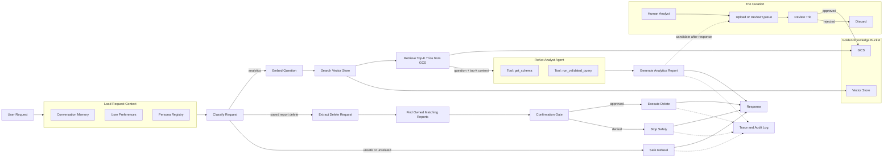
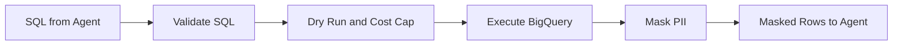
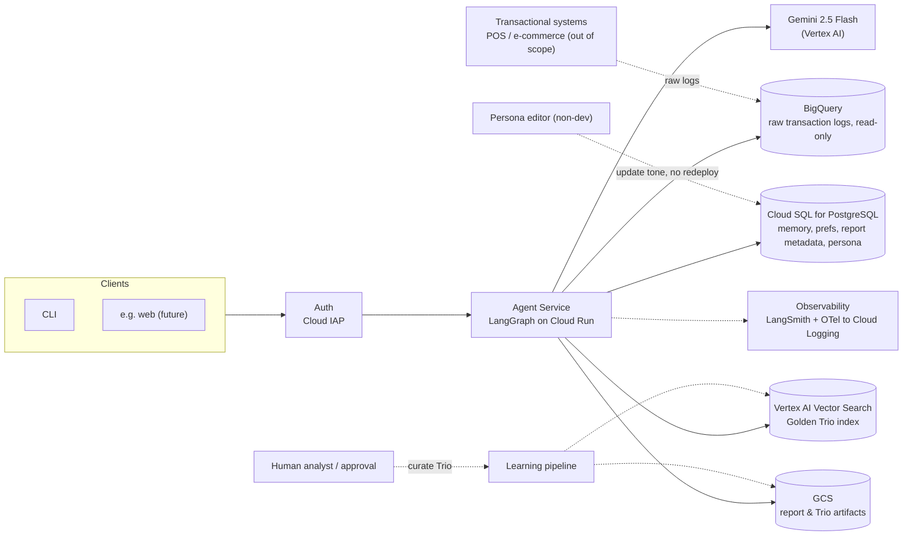

# Architecture

This is the production High-Level Design for the Retail AI Data Assistant.

The design is hybrid:

- Analytics uses a ReAct analyst agent because query planning is open-ended.
- Destructive saved-report actions use a deterministic confirmation workflow.
- Golden Trios are retrieved before analytics reasoning, but created through a separate human
  curation flow.
- The only database execution tool validates, runs, and masks results before the agent sees rows.

## Graph



The graph shows the request path and the Trio curation path. Curation feeds the Golden Knowledge
Bucket out of band and does not run on the user request path.

## The `run_validated_query` Tool



## Production Components



The agent reads transaction logs from BigQuery. Upstream systems such as point-of-sale and
e-commerce checkout write those logs and are out of scope here. The prototype uses the read-only
public `thelook_ecommerce` dataset, so it does not ingest data.

Golden Knowledge uses three pieces: **Vertex AI Vector Search** for the Trio index, **GCS** for full
Trios, and the **learning pipeline** to embed approved Trios. Vector Search is the production pick
because retrieval quality and low-latency online search matter more than saving one managed service
for this use case. `pgvector` is the cheaper fallback when the Trio corpus is small and the team is
comfortable owning more retrieval code. Keeping memory, preferences, report metadata, and persona
config in Postgres still keeps transactional state simple.
Saved report bodies live in GCS, while Postgres stores ownership, lifecycle fields, and searchable
metadata for delete matching.

## Stack Choices

Each row lists the choice, why it is used, and when to switch.

| Building block | Choice | Why | Trade-off / when to switch |
| --- | --- | --- | --- |
| Serving | Cloud Run | Stateless, scale-to-zero for bursty exec usage; managed deploys. Graph state (conversation memory + confirmation `interrupt` checkpoints) persists in Cloud SQL via LangGraph's Postgres checkpointer, keyed by user/thread id | GKE only if concurrency/networking outgrows it |
| Clients | CLI now; pluggable (e.g. web) later | One service API; new channels are additive | N/A |
| Identity / Auth | Cloud IAP for internal deployment; app JWT if external | Manager identity drives per-user prefs (#4) and report ownership (#3) | IAP is simplest for company SSO; JWT fits external clients |
| Orchestration | LangGraph | Explicit, deterministic routing / refusal / destructive workflow | N/A |
| Analyst loop | LangChain v1 `create_agent` | ReAct loop without custom agent plumbing | Hand-roll only if custom control flow is needed |
| Model | Gemini 2.5 Flash on Vertex AI | Matches the spec preference; low cost/latency; native GCP IAM/quotas | Flash by default; escalate to Pro per-query or on retry for harder reasoning; AI Studio free key for dev only |
| Analytics data | BigQuery (read-only) | The assigned dataset; serverless; `maximum_bytes_billed` caps cost | N/A |
| SQL guard | `sqlglot` + BigQuery dry-run | Enforces read-only shape + caps cost before execution | `sqlglot`'s BigQuery dialect can trail new syntax; dry-run adds a round-trip per query |
| Operational store | Cloud SQL for PostgreSQL | Managed Postgres (GCP's RDS equivalent); one store for memory, prefs, report metadata, and persona keeps ops low | One DB is a single point of failure and mixes transactional + vector load; add replicas or split vector search out when load demands |
| Vector Store | Vertex AI Vector Search | Managed, low-latency retrieval for Golden Trios; less custom retrieval code to own | `pgvector` is cheaper for small corpora if retrieval quality/latency are not yet a problem |
| Artifacts | GCS | Cheap durable blobs (full Trios, report files); Postgres holds pointers | N/A |
| Persona | Postgres config rows, hot-loaded | Non-devs change tone weekly, no redeploy, versioned rollback (#8) | DB row + cache is enough here |
| Learning | Async curation job | Embeds approved Trios off the request path; bucket improves continuously (#1) | New Trios are retrievable after the job runs |
| Observability (agent) | LangSmith | Best fit for LangGraph/LangChain traces, tool calls, message correspondence, and eval (#6, #7) | Langfuse is the alternative when open source, self-hosting, cost control, or data residency matter more |
| Observability (infra) | OpenTelemetry to Cloud Logging/Monitoring | Infra metrics, dashboards, alerting | N/A |

Add most new capabilities as tools, not new graph branches. A `render_chart` tool, or a new data
source behind the same `schema_context()` / `query()` interface, is just one more tool the analyst
can call, so the classifier and graph do not change. Use a branch only for destructive actions that
need a confirmation step, like delete; a `send_email` tool would follow that same pattern.

## Analytics Data Flow

1. The user sends a request.
2. The system loads request context: authenticated user, conversation memory, user preferences,
   and active persona.
3. The router classifies the enriched request as analytics, saved-report delete, or
   unsafe/unrelated.
4. The system embeds the question, searches the Vector Store, and retrieves the top-k full Trio
   objects from GCS.
5. The ReAct analyst receives one state object: original question, user context, persona context,
   and top-k Trio context.
6. The analyst uses the Trios as examples for SQL shape, metric choice, joins, and report framing.
7. The agent calls `get_schema`, then `run_validated_query`.
8. `run_validated_query` is the only BigQuery path: validate, execute, and mask PII before returning
   rows (see the tool diagram above and Requirements #2).
9. The agent writes an executive report only from masked rows and approved Golden context.
10. The run is traced with classification, tool calls, SQL validation result, retry count, bytes
   billed, provider errors, and final outcome.

## Golden Knowledge Lifecycle

The Golden Knowledge Bucket is reviewed knowledge, not automatic memory. It stores human-approved
Trios:

```text
Question -> SQL Query -> Analyst Report
```

Trios enter in two ways: an analyst uploads a historical Trio, or a generated report is nominated by
human signal and approved. Requirements #1 defines the nomination policy.

Approved Trios are stored as versioned objects with metadata: owner, approval status, data
watermark, source tables, and time window. A curation job embeds each Trio into the Vector Store.
Analytics requests search the Vector Store, then load the full Trios from GCS.

## Destructive Saved-Report Flow

Saved reports are user-owned data, so deletes use a deterministic path instead of the analyst agent.
The graph shows the flow: extract intent with the LLM, resolve owned matches, pass the confirmation
gate, then soft delete and audit. Only extraction uses the LLM. Resolution, ownership checks,
confirmation, and audit stay deterministic. Requirements #3 has the step-by-step detail.

## Prototype As Built

The prototype implements the analytics path only: classify the request, run a ReAct analyst agent,
call `get_schema`, call guarded `run_validated_query`, mask PII, and return a CLI answer. That covers
two of the five prototype options: **Safety & PII Masking** and **Resilience & Graceful Error
Handling**. Everything else in this document is design-only and marked per requirement in
Requirements.
